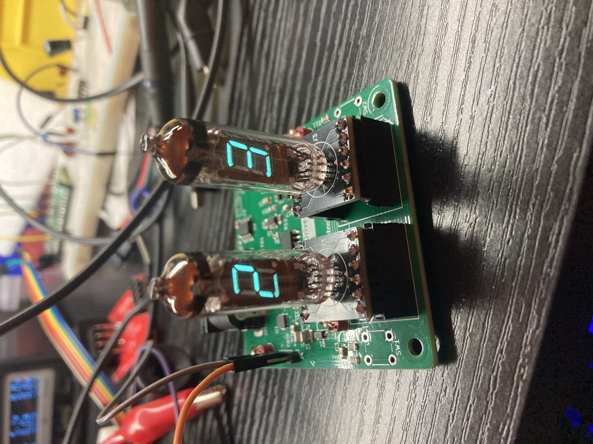

# Dual IV-8 VFD Display Drivers

This project is to drive two IV-8 displays

# History

This project started because I scored two IV-8 VFD Displays off a flea market, and thus I needed something to drive them

# Project Structure
- CAD: FreeCAD source files for the enclosure (WIP)
- PCB_Driver: KiCAD files for the driver board
- PCB_IV-8: KiCAD files for the IV-8 mounting board
- PCB_IV-8_Test: KiCAD files for a test board equivalent to above, used before using a real display in case the circuit is borked
- Sim_Osci: KiCAD files for a simulation of the oscillating circuit, taken from an EEVBlog forum
- Firmware_count: A simple firmware that counts the VFDs up from 0 to 99
- Firmware_main1: The primary firmware, this one also implements UART communication with a host

# Driver Board Issue, Rev 1
There were some erratas that proped out during testing of Rev 1 of the driver board. The following hardware bug fixes must be made for the board to be usable
- For the filament drive circuit, R17 needs to be shorted, and add two series 25ohm resistor (by cutting traces) of `FIL_A` and `FIL_B`
- Add a series 100kohm resistor between the Q1-Q3 and the outputs of Q6 to the gate of the PFET
    - Turns out there was a maximum Source-to-Gate limit of +-20v, which this circuit clearly exceeds when driving the FETs. With the 100k resistor, when driving the segment Vgs is at -5.83v

# License
This project is licensed under GPLv3. See [LICENSE.md](LICENSE.md) for details.
